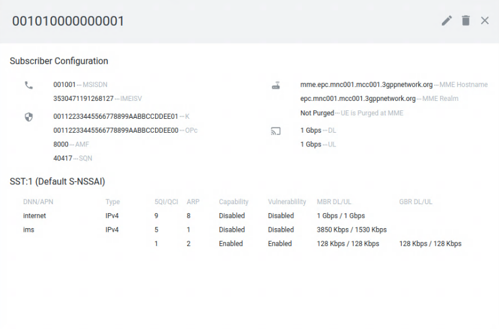
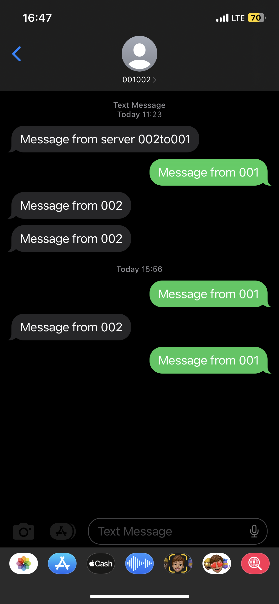

# Open5GS  IMS
Quite contrary to the name of the repository, this repository contains docker files to deploy an Over-The-Air (OTA) or RF simulated 4G/5G network using following projects:
- Core Network (4G/5G) - open5gs - https://github.com/open5gs/open5gs
- IMS (Only 4G supported i.e. VoLTE) - kamailio
- IMS HSS - https://github.com/nickvsnetworking/pyhss
- Osmocom HLR - https://github.com/osmocom/osmo-hlr
- Osmocom MSC - https://github.com/osmocom/osmo-msc
- srsRAN (4G/5G) - https://github.com/srsran/srsRAN
- UERANSIM (5G) - https://github.com/aligungr/UERANSIM

## Tested Setup

Docker host machine

- Ubuntu  22.04

Over-The-Air setups: 

- srsRAN (eNB/gNB) using Ettus USRP B210
- srsRAN (eNB/gNB) using Microphase ANTSDR U220 (check [antsdr-branch](https://gitlab.com/humanitasio/telecom/open5gs_ims/-/tree/antsdr-branch?ref_type=heads))

RF simulated setups:

 - srsRAN (gNB + UE) simulation over ZMQ
 

## Build and Execution Instructions

* Mandatory requirements:
	* [docker-ce](https://docs.docker.com/install/linux/docker-ce/ubuntu) - Version 22.0.5 or above
	* [docker-compose](https://docs.docker.com/compose) - Version 2.14 or above
  * [UHD](https://github.com/EttusResearch/uhd) - Version 4.0 or above (official or [MicroPhase](https://github.com/MicroPhase/antsdr_uhd))


#### Clone repository and build base docker image of open5gs, kamailio, ueransim

```
git clone https://gitlab.com/humanitasio/telecom/open5gs_ims.git
cd open5gs_ims/base
docker build --no-cache --force-rm -t docker_open5gs .

cd ../ims_base
docker build --no-cache --force-rm -t docker_kamailio .

cd ../srslte
docker build --no-cache --force-rm -t docker_srslte .

cd ../srsran
docker build --no-cache --force-rm -t docker_srsran .

cd ../ueransim
docker build --no-cache --force-rm -t docker_ueransim .
```

#### Build and Run using docker-compose

```
cd ..
set -a
source .env
sudo ufw disable
docker-compose -f 4g-volte-deploy.yaml build
docker-compose -f sa-deploy.yaml build
sudo sysctl -w net.ipv4.ip_forward=1
echo "performance" | sudo tee /sys/devices/system/cpu/cpu*/cpufreq/scaling_governor
```

###### 4G deployment
**SDR:**
- Teminal 1:
```
# 4G Core Network + IMS + SMS over SGs
docker-compose -f 4g-volte-deploy.yaml up
```

- Terminal 2:
```
# srsRAN eNB using SDR (OTA)
docker-compose -f srsenb.yaml up -d && docker container attach srsenb
```
**Simulation:**
```
# srsRAN ZMQ eNB (RF simulated)
docker-compose -f srsenb_zmq.yaml up -d && docker container attach srsenb_zmq

# srsRAN ZMQ 4G UE (RF simulated)
docker-compose -f srsue_zmq.yaml up -d && docker container attach srsue_zmq
```

###### 5G SA deployment

> not tested yet 

<!-- ```
# 5G Core Network
docker-compose -f sa-deploy.yaml up

# srsRAN gNB using SDR (OTA)
docker-compose -f srsgnb.yaml up -d && docker container attach srsgnb

# srsRAN ZMQ gNB (RF simulated)
docker-compose -f srsgnb_zmq.yaml up -d && docker container attach srsgnb_zmq

# srsRAN ZMQ 5G UE (RF simulated)
docker-compose -f srsue_5g_zmq.yaml up -d && docker container attach srsue_5g_zmq

# UERANSIM gNB (RF simulated)
docker-compose -f nr-gnb.yaml up -d && docker container attach nr_gnb

# UERANSIM NR-UE (RF simulated)
docker-compose -f nr-ue.yaml up -d && docker container attach nr_ue
``` -->


## Provisioning of SIM information

### USIM  Card  configuration:

I'm already make this two sim card (<i>test1,test2</i>), so you can follow the same algorithm.

| SubscriberConfig | SIM001 | SIM002 |
| --- | --- | --- |
| IMSI | 001010000000001 | 001010000000002 |
| Ki | 00112233445566778899AABBCCDDEE01 | 00112233445566778899AABBCCDDEE02 |
| Opc | 00112233445566778899AABBCCDDEE00 | 00112233445566778899AABBCCDDEE01 |
| MSISDN | 001001 | 001002 |


### 1) Add SIM information in open5gs HSS as follows:

Open (http://<DOCKER_HOST_IP>:3000) in a web browser, where <DOCKER_HOST_IP> is the IP of the machine/VM running the open5gs containers (you can find that with ```ifconfig``` ). Login with following credentials
```
Username : admin
Password : 1423
```
Using Web UI, add a subscriber

<!-- <h3 id="register_open5gs">Register subscribers information with Open5GS</h3> -->

**Please also register MSISDN.** At that time, set the APN setting information as follows.
| APN | Type | QCI | ARP | Capability | Vulnerablility | MBR DL/UL(Kbps) | GBR DL/UL(Kbps) |
| --- | --- | --- | --- | --- | --- | --- | --- |
| internet | IPv4 | 9 | 8 | Disabled | Disabled | unlimited/unlimited | |
| ims | IPv4 | 5 | 1 | Disabled | Disabled | 3850/1530 | |
| | | 1 | 2 | Enabled | Enabled | 128/128 | 128/128 |

<summary>ScreenCapture Preview </summary> </br>
  <body>
    <p align="center">  </p>
  </body>
</details>


### 2) Add SIM card in OsmoHLR as follows:

1. First, login to the osmohlr container

```
docker exec -it osmohlr /bin/bash
```

2. Then, telnet to localhost

```
$ telnet localhost 4258

OsmoHLR> enable
OsmoHLR#
```

3. Finally, register the subscriber information as in following example:

```
OsmoHLR# subscriber imsi 001010000000001 create
% Created subscriber 001010000000001
    ID: 1
    IMSI: 001010000000001
    MSISDN: none
OsmoHLR# subscriber imsi 001010000000001 update msisdn 001001
% Updated subscriber IMSI='001010000000001' to MSISDN='001001'
OsmoHLR#
```
Make sure this subscriber information is registered.
```
OsmoHLR# show subscribers all
ID     MSISDN        IMSI              IMEI              NAM
-----  ------------  ----------------  ----------------  -----
1      001001          001010000000001    -------------    CSPS  
 Subscribers Shown: 1
OsmoHLR#
```
This setting is required to function as **SMS over SGs**.

<h2 id="try">Try VoLTE and SMS</h2>

Make sure that you can make a VoLTE call and SMS to the MSISDN. If your device does not support **SMS over IMS**, you can send SMS with **SMS over SGs** depending on your device.

> **Note.** Kamailio's SMS (SMS over IMS) doesn't seem to handle multibyte messages properly, which causes garbled characters in SMS.
On the other hand, OsmoMSC (SMS over SGs) seems to handle multibyte messages properly without garbled characters.

<h3 id="osmomsc_send_command">Send SMS from OsmoMSC VTY terminal (SMS over SGs)</h3>

You can send SMS to the destination terminal by command operation on the OsmoMSC VTY terminal (SMS over SGs).
Please login to the `osmomsc` container and send SMS from the command line as following.
https://downloads.osmocom.org/docs/latest/osmomsc-usermanual.pdf


**For example, if the following IMSI and MSISDN are registered in OsmoHLR**
| IMSI | MSISDN | SIM |
| --- | --- | --- |
| 001010000000001 | 001001 | x |
| 001010000000002 | 001002 | x |

First, login to the `osmomsc` container.
```
# docker exec -it osmomsc /bin/bash
```
Then telnet to localhost.
```
# telnet localhost 4254
...
OsmoMSC> enable
OsmoMSC#
```

- Command line to send SMS from MSISDN=001001 to MSISDN=001002 where the corresponding SIM exists
```
OsmoMSC# subscriber msisdn 001002 sms sender msisdn 001001 send TEST MESSAGE
```
- Command line to send SMS from MSISDN=001001 to MSISDN=001002 for which there is no corresponding SIM
```
OsmoMSC# subscriber msisdn 001002 sms sender msisdn 001001 send TEST MESSAGE
```

<summary><b> ScreenCapture Preview: </b> </summary> </br>
  <body>
    <p align="center">  </p>
  </body>
</details>


### Add SIM information in pyHSS is as follows (realated SIP (VoLTE)):

1. Goto http://172.22.0.18:8080/docs/
2. Select **apn** -> **Create new APN** -> Press on **Try it out**. Then, in payload section use the below JSON and then press **Execute**

```
{
  "apn": "internet",
  "apn_ambr_dl": 0,
  "apn_ambr_ul": 0
}
```

Take note of **apn_id** specified in **Response body** under **Server response** for **internet** APN

Repeat creation step for following payload

```
{
  "apn": "ims",
  "apn_ambr_dl": 0,
  "apn_ambr_ul": 0
}
```

Take note of **apn_id** specified in **Response body** under **Server response** for **ims** APN

**Execute this step of APN creation only once**

3. Next, select **auc** -> **Create new AUC** -> Press on **Try it out**. Then, in payload section use the below example JSON to fill in ki, opc and amf for your SIM and then press **Execute**

```
{
  "ki": "00112233445566778899AABBCCDDEE01",
  "opc": "00112233445566778899AABBCCDDEE00",
  "amf": "8000",
  "sqn": 0,
  "imsi": "001010000000001"
}
```

Take note of **auc_id** specified in **Response body** under **Server response**

**Replace imsi, ki, opc and amf as per your programmed SIM**

4. Next, select **subscriber** -> **Create new SUBSCRIBER** -> Press on **Try it out**. Then, in payload section use the below example JSON to fill in imsi, auc_id and apn_list for your SIM and then press **Execute**

```
{
  "imsi": "001010000000001",
  "enabled": true,
  "auc_id": 1,
  "default_apn": 1,
  "apn_list": "0,1",
  "msisdn": "001001",
  "ue_ambr_dl": 0,
  "ue_ambr_ul": 0
}
```

- **auc_id** is the ID of the **AUC** created in the previous steps
- **default_apn** is the ID of the **internet** APN created in the previous steps
- **apn_list** is the comma separated list of APN IDs allowed for the UE i.e. APN ID for **internet** and **ims** APN created in the previous steps

**Replace imsi and msisdn as per your programmed SIM**

5. Finally, select **ims_subscriber** -> **Create new IMS SUBSCRIBER** -> Press on **Try it out**. Then, in payload section use the below example JSON to fill in imsi, msisdn, msisdn_list, scscf_peer, scscf_realm and scscf for your SIM/deployment and then press **Execute**

```
{
    "imsi": "001010000000001",
    "msisdn": "001001",
    "sh_profile": "string",
    "scscf_peer": "scscf.ims.mnc001.mcc001.3gppnetwork.org",
    "msisdn_list": "[001001]",
    "ifc_path": "default_ifc.xml",
    "scscf": "sip:scscf.ims.mnc001.mcc001.3gppnetwork.org:6060",
    "scscf_realm": "ims.mnc001.mcc001.3gppnetwork.org"
}
```

**Replace imsi, msisdn and msisdn_list as per your programmed SIM**

**Replace scscf_peer, scscf and scscf_realm as per your deployment** --> -->

## Test and Analyze

### Sniff Network
For wirshark SMS and VoLTE sniffing:
- open **Wireshark** as root.
- choose the ```br-6851400878ea```  interface (addr: 172.22.0.1).
- enter a new filter : ```sip || s1ap || gtpv2``` , and then apply the filter (OK)

### Internet speed test
First install the Iperf3 (optional), 
```sh
sudo apt update
sudo apt -y install iperf3
```
On the host device run this command: (or you can see the --help)
```sh
iperf3 -s -i 20 D
```
And on the UE side choose an app that support iperf3 and add:
- <b>ip</b>: 172.22.0.1
- <b>port</b>: 5201 (check the port on the host terminal)
And run the test.

maybe you need to enter some command you can use this as example:
```sh
iperf3 -c 172.22.0.1 -p 5201 -t 10 -i 30
```

## Configuration (optional for advanced use)

For the quick run (eNB/gNB, CN in same docker network), edit only the following parameters in **.env** as per your setup

```
MCC
MNC
TEST_NETWORK --> Change this only if it clashes with the internal network at your home/office
DOCKER_HOST_IP --> This is the IP address of the host running your docker setup
SGWU_ADVERTISE_IP --> Change this to value of DOCKER_HOST_IP set above only if eNB is not running the same docker network/host
UPF_ADVERTISE_IP --> Change this to value of DOCKER_HOST_IP set above only if gNB is not running the same docker network/host
UE_IPV4_INTERNET --> Change this to your desired (Not conflicted) UE network ip range for internet APN
UE_IPV4_IMS --> Change this to your desired (Not conflicted) UE network ip range for ims APN
```

If eNB/gNB is NOT running in the same docker network/host as the host running the dockerized Core/IMS then follow the below additional steps

###### 4G deployment

Under mme section in docker compose file (**4g-volte-deploy.yaml**), uncomment the following part
```
...
    # ports:
    #   - "36412:36412/sctp"
...
```

Then, uncomment the following part under **sgwu** section
```
...
    # ports:
    #   - "2152:2152/udp"
...
```

###### 5G SA deployment

Under amf section in docker compose file (**sa-deploy.yaml**), uncomment the following part
```
...
    # ports:
    #   - "38412:38412/sctp"
...
```

Then, uncomment the following part under **upf** section
```
...
    # ports:
    #   - "2152:2152/udp"
...
```
## Not supported
- IPv6 usage in Docker
